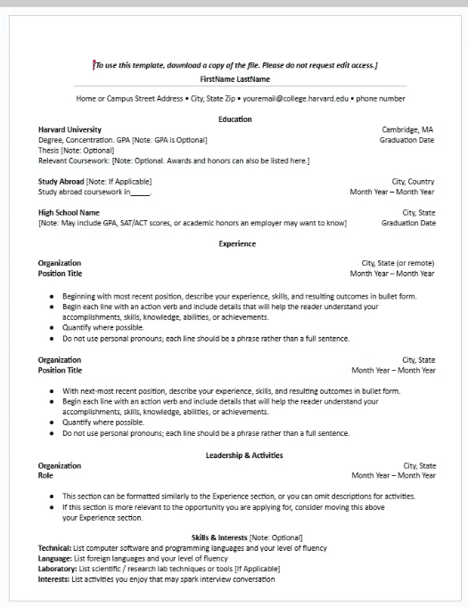
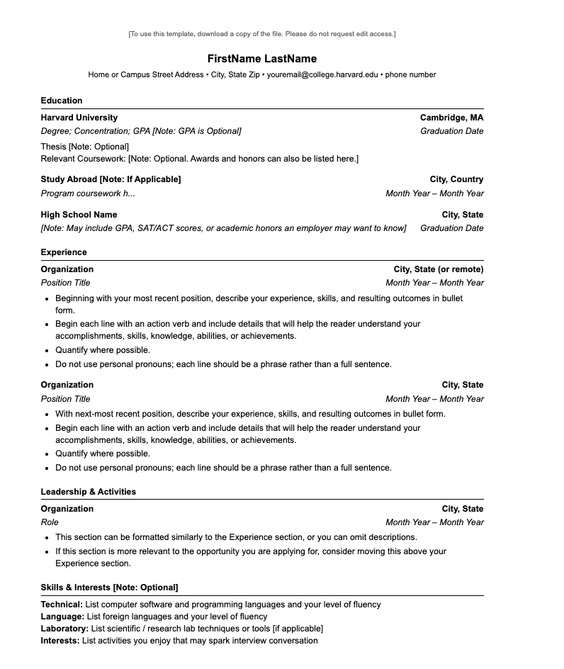

# Frontend Technical Specification

## What we want to accomplish? 

- We want to create a static website that serves and html resume.

## Resume Format Considerations

I live in Spain and i resumes in word/pdf format are suppose to have 
fotos and prefered reference for gender call .
However in a personal website or Linkedin Profile could have those information 
Dont include GPA grades and so on. 
We are going to use this [Harvard Resume Template](./docs/Harvard.jpeg) format as the basis of my resumee. 

### Harvard Resume Format Generation
i will let GenAi do the heavylifting for html and possibly CSS and from there i will manually refactor the code
to my preferred standard

Prompt to Claude Code Sonnet 4.5
´´´text
Convert this resume format into html
Please dont use a css framework. 
Please use the least amount of css tags .
´´

Image provided to LLM

This is the [generated output](./docs/jan-18-26-resume.html) i will refactor

This is the generated HTML looks like unaltered: 

## HTML Adjustments
- Because we want to apply mobile styling to our website we will include the viewport meta tag so mobile scales nomrally
- We will extract our style into its own stylesheet after we are happy with our HTML markup 
- We will simplify our HTML markup css selector to be as minimal as possible. 
- I Will use Prettier as formatter for our html
